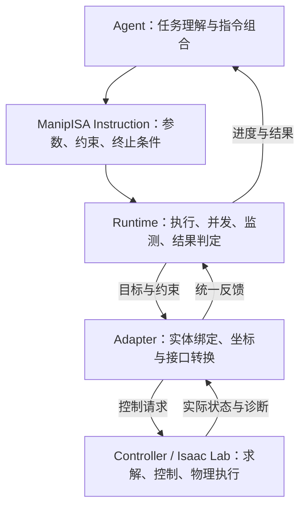

# ManipISA：Isaac Lab 执行层设计草案

状态：六个操作码均有执行路径。已接入关节/位姿、结构化接触与力反馈，并支持可选 RGB 回传；TacMap 触觉图像本期不接入。具体接口和边界见 [Runtime 说明](../README.md) 与 [接触执行说明](manipisa-interaction-runtime.md)，测试与仿真证据见 [运行记录](manipisa-runtime-validation.md)。基于本地 Isaac Lab 源码版本 2.3.2；在线参考为官方 2.3.0 文档，不代表已验证其他版本。本文不改变 [v0.2 六条核心指令](manipisa-v0.2-core-contracts.md) 的平台无关语义。

## 1. 下一层的职责

下一层是指令执行层：把一条 ManipISA 指令转换成可逐步执行、可监测、可中止并可交接控制权的控制任务。Isaac Lab 提供运动学、控制器、执行接口和物理观测；ManipISA 负责契约落实、任务协调与结果判定。

可以直接复用 Isaac Lab 的 IK。IK 位于底层控制实现中，由 Adapter 接入，不增加为第七条指令，也不承担指令成功判定。

主架构采用 Agent → Instruction → Runtime → Adapter → Controller。当前版本不设置独立 Safety、Capability 模块，也不建立独立能力描述对象或能力发现服务。Adapter 在执行准备阶段检查指令、参数组合、所需控制与观测是否已实现；不支持时，在产生物理动作前明确拒绝。

Actor、Entity、Frame 和 ContactSet 保持抽象。具体关节、刚体、TCP、USD prim 路径和执行器参数只在场景绑定与适配器中出现。参与者数量由资源集合表达；双臂并不新增操作码。

控制任务是 Runtime 内部目标和约束的数据表示，不成为额外架构层或另一套任务语言。多个指令可以并发，但每个关节资源在每个控制周期只有一个最终命令写入者。Runtime 管理资源、兼容关系和共同目标，通过 Adapter 调用适合该任务的控制实现；物理上耦合的目标必须得到统一协调。

约束的定义来源保持一致。底层已支持的运动约束交给 Controller 或求解器落实；Runtime 监测任务不变量、成功条件、时限与控制交接。若必需约束无法落实或必要证据不可获得，准备阶段拒绝相应请求。执行中出现求解失败、约束违反或证据失效时，按指令契约报告并处理，不需要另设 Safety 求解器。

## 2. Isaac Lab 已有组件与复用边界

| 组件 | 可以复用的能力 | ManipISA 仍需承担 |
| --- | --- | --- |
| DifferentialIKController | 根据当前位姿、Jacobian、关节位置和目标计算局部关节位置增量；可选 DLS 等算法 | 目标插值、坐标系与索引绑定、限位和碰撞约束、不可行诊断、真实状态验收 |
| DifferentialInverseKinematicsAction | 目标缩放、刚体和关节绑定、偏置处理、下发关节目标的 ActionTerm 包装 | 指令生命周期、对象目标、并发控制和契约监测 |
| Articulation | 关节/刚体状态与动力学访问；位置、速度、力矩目标下发 | 每周期控制权、执行模式匹配、限值与控制交接 |
| OperationalSpaceController / 对应 Action | 任务空间运动和力控制，输出关节力矩 | 接触接口绑定、可观测性、完整力矩反馈、抓持和双臂承载协调 |
| ContactSensor | 接触法向力、过滤后的接触对数据；配置后可提供摩擦力和平均接触位置 | 接触证据有效性、分离证据、滑移/抓持谓词、目标接口的 wrench 汇总与验证 |

可以在已有仿真循环中直接调用控制器类，不必为了使用 IK 先改造成 ManagerBasedRLEnv。ActionTerm 是可选接入方式；采用它时，必须避免另一个循环同时向相同关节下发命令。

### IK 的正确使用位置

一个控制周期的逻辑是：

1. 读取实际关节状态、末端位姿、Jacobian 和必要的对象状态。
2. 执行层校验当前阶段约束，协调所有活动目标，并生成这一周期的受限位姿目标。
3. IK 计算候选关节目标；处理限位、连续性和碰撞等约束。无法满足时反馈不可行，不能把被裁剪的命令冒充原目标已完成。
4. 通过 set_joint_position_target 下发目标，调用 write_data_to_sim，推进物理仿真，再更新状态和传感器。
5. 根据新观测评估目标、连续满足时间和不变量；随后继续、完成或进入约定的失败处理。

DifferentialIKController.compute 返回 joint_pos + delta_joint_pos。它是局部微分求解步骤，不自动构成完整轨迹规划，也不保证最终目标可达。DLS 不能替代碰撞约束或全局可行性检查。若后处理改变了命令，应重新计算最终命令对应的运动学误差；指令成功仍由物理反馈决定。

需要统一 world、环境原点、机器人根、被控刚体和 TCP 的变换；Jacobian 必须对应正确的点、方向和关节列。Isaac Lab 适配边界明确四元数使用 wxyz，并负责与 ISA 序列化约定转换。批量环境必须分别维护观测、目标、时钟、控制句柄和结果。

write_joint_state_to_sim 可用于重置或初始化，不作为 MOVE 的正常执行方式。直接改写状态无法证明机器人通过物理运动完成了指令。

源码依据：[微分 IK](../IsaacLab/source/isaaclab/isaaclab/controllers/differential_ik.py)、[任务空间 Action](../IsaacLab/source/isaaclab/isaaclab/envs/mdp/actions/task_space_actions.py)、[Articulation](../IsaacLab/source/isaaclab/isaaclab/assets/articulation/articulation.py)。接入流程可参照官方 [task-space controller 教程](https://isaac-sim.github.io/IsaacLab/v2.3.0/source/tutorials/05_controllers/run_diff_ik.html)。

### 力与接触能力的实际边界

本地 OperationalSpaceController.compute 接收的 current_ee_force_b 为三维线性力。其闭环分支仅对线性力加入观测反馈，力矩部分仍按目标开环计算。因此不能把现成 OSC 标注为已支持完整六维闭环 APPLY_WRENCH。

ContactSensor 的 net_forces_w 与 force_matrix_w 表示法向接触力，不是完整 wrench。friction_forces_w 可在相应配置下提供汇总切向力，contact_pos_w 提供平均接触位置。对于分布接触，汇总力和平均接触点通常不足以精确重建合力矩；完整接口 wrench 需要额外验证的观测方案，并明确参考点、坐标系、方向和来源。末端刚体传感器也不能自动代表所有手指与物体的交互。

使用 OSC 还必须验证执行器的力矩控制路径、位置驱动增益与重力补偿配置。刚性位置驱动和力矩目标同时作用时，不能假设系统具有预期的力控制行为。

源码依据：[OSC](../IsaacLab/source/isaaclab/isaaclab/controllers/operational_space.py)、[接触数据定义](../IsaacLab/source/isaaclab/isaaclab/sensors/contact_sensor/contact_sensor_data.py)。配置参考官方 [Contact sensor 文档](https://isaac-sim.github.io/IsaacLab/v2.3.0/source/overview/core-concepts/sensors/contact_sensor.html)。

## 3. Runtime 与 Adapter 的接口契约

采用三类共享数据和一组执行操作。StateSnapshot、ExecutionReport 已实现；ControlTask 概念由 Instruction、PreparedTask 和 Runtime 内部调用记录共同承接。下表描述完整设计目标，当前参数组合和协议子集以 Runtime 说明为准；支持范围由 Adapter 的接口约定和执行准备检查表达。

| 契约 | 最少包含的信息 | 解决的问题 |
| --- | --- | --- |
| StateSnapshot | 仿真时间、环境标识、关节/刚体/对象状态、坐标变换、接触与力观测、每项有效性和时效 | 区分真实零值、失效数据和未知状态 |
| ControlTask | 原指令与句柄、已绑定资源、目标、不变量、允许动作范围、获取范围、优先级或兼容关系、结束与交接要求 | 完整保留上层契约，协调多个同时执行的目标 |
| ExecutionReport | 生命周期、当前阶段、误差、三值谓词证据、失败原因、残余控制句柄和控制去向 | 让用户和上层程序知道为什么成功、失败或仍在维持 |

公共执行协议覆盖准备、启动、逐步执行、更新、读取反馈、查询、取消和控制移交。Runtime 接收提交请求，通过 Adapter 完成目标与资源绑定，并在控制生效前重检前置条件。准备操作不得产生物理动作；它检查具体请求所需的目标类型、执行模式、控制方向、约束、证据和并发组合是否受支持，并返回绑定结果或明确的拒绝原因。这些管理操作不计入六条物理指令。

支持范围可以随 Adapter 实现固定，无须另建动态注册中心。UNSUPPORTED_CAPABILITY 继续作为失败原因名称使用，不意味着存在同名架构模块。

执行层使用现有规范的 RUNNING、ACTIVE、SUCCEEDED、FAILED、REJECTED、CANCELED；条件证据使用 SATISFIED、VIOLATED、UNKNOWN。后端返回候选命令、数值误差和诊断，不自行把“求解器返回正常”提升为 SUCCEEDED。

持续模式进入 ACTIVE 后继续运行。失败、取消和完成均须执行 continuation；不能统一以“把命令设为零”结束，因为这可能解除维持中的抓持或支撑。检测频率、最大检测延迟和失效后的响应范围必须显式声明。

## 4. 六条指令如何落实到这个后端

| 指令 | 初步执行路线 | 必须独立验证的成功或维持证据 |
| --- | --- | --- |
| SHAPE_HAND | 通过构型映射生成关节目标，由 Articulation 执行 | 实际构型误差、速度、连续满足时间，以及已有约束 |
| MAKE_CONTACT | 在许可范围内调整位姿或构型；臂运动可使用 IK | 指定双方和区域的接触成立，符合要求的接触行为与作用力限值 |
| BREAK_CONTACT | 按许可方向和范围撤离，同时保留其他必要支撑 | 指定接触已解除并满足分离条件；零接触力单独不足以证明分离 |
| MOVE | ACTOR_FRAME 可直接使用位姿控制；ENTITY_FRAME 需要依据交互关系协调参与者运动 | 被控目标本身的位姿/轨迹误差；对象目标必须检查对象反馈 |
| CONTROL_GRASP | 根据 GraspSpec 调整许可范围内的构型和接触作用；复用底层位置或力控制 | 抓持关系、允许运动、负载条件与必要滑移证据；不能用“接触存在”代替 |
| APPLY_WRENCH | 在已验证能力方向上使用 OSC 或适配控制器，作用于指定交互接口 | 该接口在指定参考点/坐标系下的实际力与力矩；观测不到的必要分量不能宣称满足 |

CONTROL_GRASP 与 MOVE 不得隐式增加或解除接触关系。控制算法只能在上层声明的允许变化与获取范围内工作。上述现成组件不直接实现本规范的抓持契约；相应的控制、负载条件评估和监测逻辑需要由执行层补齐。

对象运动不能简单地“把对象目标复制成两个末端目标”。在刚性无滑移抓持假设成立时，可以通过已验证的相对变换计算各末端目标；滑移、滚动或柔性接触需要相应模型和适配能力。

两侧目标互不耦合时，可分别运行 IK，再统一处理资源和碰撞约束。共同控制一个对象时，即使使用两个局部 IK 求解器，也必须协调相对位姿、闭链可行性、负载和接触约束。两个 IK 各自返回结果不等于共同操作可行。

## 5. 现有 Bench2Dex 接入点

本地 Bench2Dex 已有 [ContactSensorReader](../Bench2Dex/collector/contact_sensor_reader.py)，run_policy.py 会在配置 contact_pairs 后创建它，并在物理步后更新。它能够读取指定接触对的世界系法向力，可以作为适配基础。

但当前读取器不能直接承担 ManipISA 的完整证据职责：

- read 中部分异常或索引缺失会返回零力，update 中异常被忽略；需要区分无接触、读取失败与观测过期。
- 当前读取选取第一个环境和刚体，需要核实或扩展环境/刚体绑定，才能宣称支持批量执行。
- 返回值尚未携带时间、有效性和完整 wrench；接触解除、抓持成立和力矩目标需要其他证据。

本地 [资产配置](../Bench2Dex/robots/multi_ur5_wuji_with_flange.py) 使用 ImplicitActuatorCfg，spawn 默认关闭 activate_contact_sensors。具体任务所需刚体的接触报告、传感器过滤与初始化顺序需要核验，不能仅凭资产默认值认定所有任务都没有接触观测。

接入时尽量保留已有仿真循环，由一个明确的执行入口负责最终命令和物理步进。所有基线共享同一物理与观测配置；不能仅为 ISA 方法改变摩擦、执行器或接触参数后直接比较成绩。

## 6. 建议实现顺序与验收范围

先确定三类共享数据与执行协议，再逐步接入各指令组合。六条操作码保持不变，不受支持的组合在准备阶段返回 UNSUPPORTED_CAPABILITY。

| 阶段 | 接入能力 | 核心验收 |
| --- | --- | --- |
| A | SHAPE_HAND；MOVE 的 ACTOR_FRAME、REACH/SUSTAIN | 实际反馈完成判定、坐标/TCP 正确、限位与碰撞处理、取消与交接、逐环境状态隔离 |
| B | MAKE_CONTACT、BREAK_CONTACT | 接触双方与区域绑定、缺测不冒充无接触、分离证据、其他支撑不被无意解除 |
| C | CONTROL_GRASP；MOVE 的 ENTITY_FRAME 与耦合参与者 | 对象证据、抓持义务、闭链约束、并发兼容、失败后控制接续 |
| D | APPLY_WRENCH 的已验证方向和接口 | 执行器模式、真实力反馈、参考点/坐标系、受限方向能力；再扩展经验证的力矩控制 |

本阶段最小闭环是：提交 MOVE → 实际物理运动 → 根据真实目标误差验证 → 完成或明确失败 → 交接控制权。仅显示末端到达目标不足以验收整个执行层。

## 7. 设计复核与待验证事项

本文在设计层检查了上一层的四项要求：

| 上层要求 | 执行层的保留位置 | 尚需通过运行验证的部分 |
| --- | --- | --- |
| 前置条件 | Adapter 准备检查、Runtime 证据准入；控制接管前重检 entry_guard | 状态变化与接管的时间一致性 |
| 成功证据 | 带目标/时效的实际观测、三值谓词、连续满足计时 | 观测可用性、误差阈值和检测延迟 |
| 并发限制 | 资源所有权、物理耦合分析、每周期统一命令输出 | 兼容控制器组合、闭链稳定性和竞争情况 |
| 失败行为 | 失败终态、原因与证据、continuation 和剩余 ControlHandle | 各执行模式下的受限停止、持续支撑与移交 |

已有契约测试、UR5＋Wuji 空闲空间验证，以及双指自由物体夹持/探头施力的接触物理验收。APPLY_WRENCH 使用位置导纳与原始接触/摩擦点重建反馈，没有直接采用现成 OSC。任意独立六轴力矩控制、对象运动、Wuji 具体抓持任务与 Bench2Dex 正式成绩仍待验证；六个操作码可执行不等于完整契约证明。TRANSFER_SUPPORT 的程序级验证仍沿用 v0.2 文档中的未决状态。

## 8. 当前实现状态

2026-10-04 新增 `DualUr5WujiAdapter`，将双 UR5＋双 Wuji 的关节、USD 腕掌固定变换、可配置 TCP 和接触区域映射集中封装。原有验证脚本已改用该入口；执行逻辑和 DLS IK 继续复用 `IsaacLabAdapter`。接入方式见 [专用 Adapter 说明](dual-ur5-wuji-adapter.md)。

2026-10-03 已实现 ManipISA Runtime、Isaac Lab Adapter 和 RGB 回传通道。六条操作码保持不变且均有可执行组合；超出当前局部接触、准静态抓持或单角色导纳范围的组合在准备阶段明确拒绝。

| 位置 | 已有内容 | 与本版 Runtime 的关系 |
| --- | --- | --- |
| ManipISA/manipisa | Runtime、目标检查、共享数据、Isaac Lab Adapter、RGB 回传 | 当前执行实现 |
| ManipISA/docs | 六条指令契约、语义映射、执行层设计、验证记录 | 区分完整设计目标与已验证实现范围 |
| ManipISA/.runtime | Python 环境、依赖、缓存和工具目录 | 项目运行环境；目录名不表示已实现指令 Runtime |
| Bench2Dex | 仿真执行循环、动作下发、状态更新、接触读取和任务评估接入 | 可复用执行基础；没有本版六条指令的统一生命周期与分发 |
| wuji/dex_hand | 单手 Skill 检查、统一观测与结果、持续抓持模式 | 可借鉴逻辑；需要按新指令和执行契约重新接入 |

已有基础可见 [Bench2Dex 执行入口](../Bench2Dex/run_policy.py)、[旧 Skill 检查与封装](../../wuji/dex_hand/skills/base.py)、[旧结果结构](../../wuji/dex_hand/core/outcome.py)、[旧持续抓持模式](../../wuji/dex_hand/modes/maintain_grasp.py)。

旧结果结构仅接受 SUCCESS/FAILED，持续模式 enter 返回的是启动操作的结果。本版需要统一表达 RUNNING、ACTIVE、SUCCEEDED、FAILED、REJECTED、CANCELED，以及持续执行、资源并发、证据失效和控制移交；不能直接把旧模式启动成功解释为整条 SUSTAIN 指令完成。

目前已跑通 Runtime—Adapter—Isaac Lab 的构型、位姿与接触闭环，复用了 IK、关节目标接口和物理步进，并新增原始 PhysX 接触反馈和位置导纳。后续重点是 Wuji 任务级标定、对象运动与耦合控制；这一轮不做 TacMap 触觉图像。

结构化反馈与 RGB 共用一个 Runtime。RGB 经 Bench2Dex CameraRig 采集并通过可选附件返回，开关不改变底层状态来源和指令成功判据。相机采集时间、ID、标定和有效性一并保留；官方评价器任务成功位、阶段分数与未来示范信息不作为在线反馈。
